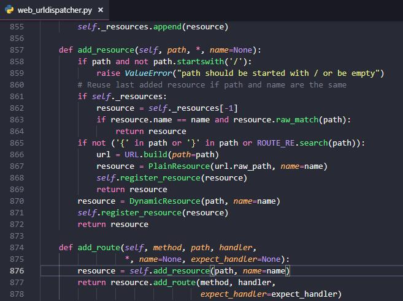
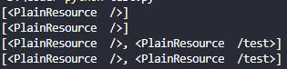
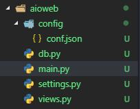
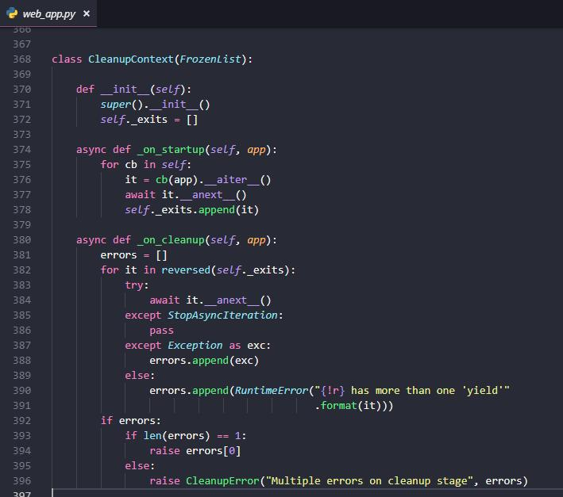

=====================
用aiohttp写服务器
=====================

| 用\ ``django``\ /\ ``flask``\ 写服务器的文章太多了，这里记录下自己用\ ``aiohttp``\ 写的过程好了。
| 部分内容直接翻译自\ `aiohttp文档`__\ 。

.. __: https://aiohttp.readthedocs.io/en/stable/web_quickstart.html

基本
=======

| 要实现一个服务器，首先要创建请求处理程序
| 既然是用\ ``aiohttp``\ 实现，那么这个程序就得是一个协程，来接受一个\ ``request``\ ，返回一个\ ``response``\ 。

.. code::

    from aiohttp import web

    async def hello(request):
        return web.Response(text='Hello, world')

由于一个服务器必须能处理\ ``url``\ ，我们在这段代码下面创建一个\ ``app``\ 绑定要处理的\ ``url``\ 并运行：

.. code::

    app = web.Application()
    app.add_routes([web.get('/', hello)])  # 绑定hello函数
    web.run_app(app)

运行这段代码，然后在浏览器打开\ http://localhost:8080/\ 会看到网页显示\ ``Hello, world``\ 。

如果喜欢\ ``flask``\ 那样的路由，用装饰器绑定，也可以写成这样：

.. code::

    from aiohttp import web

    routes = web.RouteTableDef()

    @routes.get('/')
    async def hello(request):
        return web.Response(text="Hello, world")

    app = web.Application()
    app.add_routes(routes)
    web.run_app(app)

两段代码结果完全相同。喜欢什么，就写成那样就好了。

| 对于第一种写法，有多个路由时，由于\ ``aiohttp``\ 会合并同一路径的所有后续资源添加，为所有的\ ``HTTP``\ 方法添加唯一的资源，所以添加顺序对性能优化有一些影响。
| 例如下面2种写法：

.. code::

    app.add_routes([web.get('/path1', get_1),
                    web.post('/path1', post_1),
                    web.get('/path2', get_2),
                    web.post('/path2', post_2)]

和

.. code::

    app.add_routes([web.get('/path1', get_1),
                    web.get('/path2', get_2),
                    web.post('/path2', post_2),
                    web.post('/path1', post_1)]

第1种先添加同一路径的所有方法的写法，会更好一些。

文档是这样写的，那么我们看看源码是怎么实现的：

| 860~864行的代表表明，如果\ ``self._resources``\ 末尾元素的\ ``name``\ 和要添加的一样，那么直接返回这个元素，不会添加。
| 直接使用已有的资源，没有新建（再运行865~872行的代码），自然性能就好一些。
| 简单加个\ ``test``\ 函数绑定\ ``/test``\ ，都再加上\ ``post``\ 方法，然后\ ``print()``\ 一下\ ``self._resources``\ ，第1种写法的结果：

| 可以看出，添加\ ``post``\ 方法时直接用了已有的资源。
| 再看第2种写法：

.. image:: ../_static/c01/2-3.jpg

| 每次都创建了新的资源，自然性能就损失了一些。

连接数据库
===========

这里以\ ``mysql``\ 为例， 介绍如何连接数据库。

首先需要一个配置文件放置数据库的地址密码等，于是最好开始拆分文件，比如像我这样：

\ ``config.json``\ 用来存储数据库的配置等，可以是这样：

.. code:: json

    {
        "mysql": {
            "db": "...",
            "user": "...",
            "password": "...",
            "host": "...",
            "port": 3306
        },
        "update_interval": "0.5"
    }

\ ``update_interval``\ 是我这个项目后面会用到的更新间隔，现在暂时不管它。

然后我们需要读取这个配置文件，写在\ ``settings.py``\ 里：

.. code::

    import json

    def get_config(path):
        with open(path, encoding='utf8') as f:
            config = json.load(f)
        return config

    config_path = 'config/conf.json'
    config = get_config(config_path)

数据共享
----------

| 怎么把\ ``settings.py``\ 的\ ``config``\ 用于数据库连接？
| \ ``aiohttp.web``\ 给\ ``app``\ 和\ ``request``\ 、\ ``response``\ 实现了一个\ ``collections.abc.MutableMapping``\ 接口，简单来说就是让它们成为类似\ ``dict``\ 的对象，于是我们可以这样存储数据：

.. code::

    from settings import config

    app['config'] = config

之后在\ ``db.py``\ 里读取：

.. code::

    async def mysql_engine(app):
        mysql_conf = app['config']['mysql']
        host, port, user, password, db = mysql_conf['host'], mysql_conf['port'], mysql_conf['user'], mysql_conf['password'], mysql_conf['db']
        ...

在\ ``views.py``\ 里也可以通过\ ``request``\ 读取：

.. code::

    async def handler(request):
        config = request.app['config']

\ ``request``\ 和\ ``response``\ 的存储方法基本类似：

.. code::

    async def handler(request):
        request['my_private_key'] = "data"
        ...

    async def handler(request):
        ...
        response['my_metric'] = 123
        return response

可以给信号和中间件共享数据，这里暂时用不到。

信号
-----

| 信号处理程序可以修改传入的参数，不应该有返回值。
| 通过按顺序订阅\ ``Application.on_startup``\ 和\ ``Application.on_cleanup``\ 信号可以依序设置应用的组件并拆除。
| 另外，\ ``aiohttp``\ 从3.0起，信号处理程序必须是异步的。

| 异步连接\ ``mysql``\ 可以用\ ``aiomysql``\ 库，基本语法都和\ ``pymysql``\ 相似，不再过多介绍。
| 以下代码可以正确初始化并配置一个\ ``aiomysql``\ 引擎：

.. code::

    import aiomysql

    async def create_aiomysql(app):
        mysql_conf = app['config']['mysql']
        host, port, user, password, db = mysql_conf['host'], mysql_conf['port'], mysql_conf['user'], mysql_conf['password'], mysql_conf['db']
        app['mysql_engine'] = await aiomysql.create_pool(host=host, port=port, user=user, password=password, db=db, loop=app.loop)

    async def dispose_aiomysql(app):
        app['mysql_engine'].close()
        await app['mysql_engine'].wait_closed()

    app.on_startup.append(create_aiomysql)
    app.on_cleanup.append(dispose_aiomysql)

| 不过，由于\ ``Application.on_startup``\ 和\ ``Application.on_cleanup``\ 彼此独立，由于互相不知道彼此状态，会发生如果初始化失败，仍然会调用清理信号等状况。
| 所以以上代码应该用\ ``Application.cleanup_ctx``\ 改成这样：

.. code::

    async def mysql_engine(app):
        mysql_conf = app['config']['mysql']
        host, port, user, password, db = mysql_conf['host'], mysql_conf['port'], mysql_conf['user'], mysql_conf['password'], mysql_conf['db']
        app['mysql_engine'] = await aiomysql.create_pool(host=host, port=port, user=user, password=password, db=db, loop=app.loop)
        yield
        app['mysql_engine'].close()
        await app['mysql_engine'].wait_closed()
    
接着在\ ``main.py``\ 中注册：

.. code::

    app.cleanup_ctx.append(mysql_engine)

| \ ``Application.cleanup_ctx``\ 是一个异步生成器列表，在\ ``yield``\ 之前的代码负责初始化，在启动时调用。
| 之后的代码在清理时执行。这个生成器只能有1个\ ``yield``\ 。
| \ ``aiohttp``\ 保证清理代码只在初始化成功时才执行。

.. note:: 不熟悉异步生成器也没有关系，只要知道这个\ ``list``\ 的元素类型是这个就行了。另外，Python3.6以上才支持异步生成器，Python3.5需要先\ ``pip install async_generator``\ 。

想知道\ ``aiohttp``\ 是如何保证的？这部分的源码是这样的：

| 假设只知道生成器的概念，不知道异步生成器，从这个角度简单介绍一下这段代码：
| \ ``__aiter__``\ 和\ ``__anext__``\ 其实就是\ ``__iter__``\ 和\ ``__next__``\ 的异步版本。
| \ ``for cb in self``\ 中，\ ``self``\ 就是\ ``Application.cleanup_ctx``\ 。
| 在我们的例子中，这个列表只有1个\ ``mysql_engine``\ ，循环中的\ ``cb(app)``\ 当作\ ``mysql_engine(app)``\ ，\ ``cb(app).__aiter__()``\ 获取迭代器\ ``it``\ 。
| \ ``await it.__anext__()``\ 让代码运行到\ ``yield``\ 处，之后\ ``self._exits``\ 存储当前生成器的迭代器。
| 如果上面这段未能成功运行，\ ``self._exits``\ 就不会放入数据，于是之后的清理代码就不会执行。
| 这样，就保证了清理代码一定是在成功初始化后才执行。
| 最后，在\ ``_on_cleanup``\ 中，反转\ ``self._exits``\ ，从末尾的异步生成器开始，每个异步生成器执行\ ``yield``\ 之后的清理程序。

创建后台任务
=============

| 在一个web应用中，经常需要在后台定时或以其他方式运行一些后台任务。
| 例如，在写爬虫的存储部分时，可以通过\ ``requests``\ 等\ ``post``\ 到服务器的方式，统一让web应用来处理抓取的内容如何入库，这时就可能需要一个后台任务定时获取数据库中的某个范围（如几天内）的\ ``url``\ 。

| 以下是一个简单的例子，在\ ``db.py``\ 中添加如下代码，通过\ ``while True``\ 无限循环，可以从一个名为\ ``crawl_result``\ 的表中定时获取2000个url：

.. code::

    import asyncio

    async def get_old_urls(app):
        while True:
            async with app['mysql_engine'].acquire() as conn:
                async with conn.cursor() as cur:
                    sql = "select url from crawl_result where link!='' limit 2000"
                    await cur.execute(sql)
                    app['old_urls'] = {url for url, in await cur.fetchall()}
            interval = float(app['config']['update_interval'])
            await asyncio.sleep(3600*interval)  # 每隔interval小时运行一次

    async def start_background_tasks(app):
        app['get_old_urls'] = app.loop.create_task(get_old_urls(app))

    async def cleanup_background_tasks(app):
        app['get_old_urls'].cancel()
        await app['get_old_urls']

接着在\ ``main.py``\ 中注册：

.. code::

    app.on_startup.append(start_background_tasks)
    app.on_cleanup.append(cleanup_background_tasks)

同样的，上述代码中，\ ``start_background_tasks``\ 和\ ``cleanup_background_tasks``\ 可以改成：

.. code::

    async def background_tasks(app):
        app['get_old_urls'] = app.loop.create_task(get_old_urls(app))
        yield
        app['get_old_urls'].cancel()
        await app['get_old_urls']

再在\ ``main.py``\ 中添加：

.. code::

    app.cleanup_ctx.append(background_tasks)

这样，就创建了一个简单的后台任务。

基于类的视图
==============

把视图函数改成基于类的视图会更加灵活紧凑。
对于之前的代码：

.. code::

    @routes.get('/test')
    async def get_conf(request):
        old_urls = request.app['old_urls']
        head_urls = old_urls[:100]
        return web.Response(text=f'first 100 urls: {head_urls}')

可以改成：

.. code::

    @routes.view('/test')
    class Test(web.View):
        async def get(self):
            old_urls = self.request.app['old_urls']
            head_urls = old_urls[:100]
            return web.Response(text=f'first 100 urls: {head_urls}')

        async def post(self):
            post_data = await self.request.post()
            data = {k: v for k, v in post_data.items()}
            return web.json_response(f'{data}')

这个例子中还添加了1个post方法。

.. note::

    \ ``web.json_response(f'{data}')``\ 方法返回的其实是个\ ``str``\ ，用\ ``requests.get()``\ 后用\ ``response.json()``\ 方法后仍有可能还是\ ``str``\ 需要再次转换，这时可能是单引号字符串，可以用\ ``demjson.decode()``\ 转换，如果要用标准库\ ``json.loads()``\ 方法，需要先把单引号替换成双引号，也就是\ ``str.replace("'", '"')``\ 。

模板
======

\ ``aiohttp``\ 有一个第三方库\ ``aiohttp_jinja2``\ 支持模板。

在\ ``main.py``\ 中引入\ ``aiohttp_jinja2``\ 的基本代码：

.. code::

    from aiohttp import web
    import jinja2
    import aiohttp_jinja2

    from settings import config

    from views import routes

    if __name__ == '__main__':
        app = web.Application()
        aiohttp_jinja2.setup(app, loader=jinja2.FileSystemLoader('templates'))
        app['config'] = config
        app.add_routes(routes)
        web.run_app(app)

在\ ``views.py``\ 中的视图函数添加装饰器注明\ ``html``\ 文件的路径。这个装饰器要位于路由装饰器之下。

.. code::

    @routes.view('/hello')
    @aiohttp_jinja2.template('hello/base.html')
    class Hello(web.View):
        async def get(self):
            return {'result': "hello world"}

这样表示\ ``html``\ 文件是\ ``templates/hello/base.html``\ 。需要这样新建文件夹和文件。

静态文件
---------

| 新建\ ``static/css/style.css``\ 等文件夹和文件，\ ``static``\ 文件夹和\ ``templates``\ 文件夹同一目录。
| 在\ ``html``\ 文件简单写几行代码引入这个\ ``css``\ ：

.. code::

    <head>
        <link rel="stylesheet" href="{{ static('css/style.css') }}" type="text/css" />
    </head>

然后，在\ ``main.py``\ 中添加2行代码：

.. code::

    app['static_root_url'] = 'static'
    app.router.add_static('/static/', path='./static', name='static')

就能成功引入这个\ ``style.css``\ 文件。

